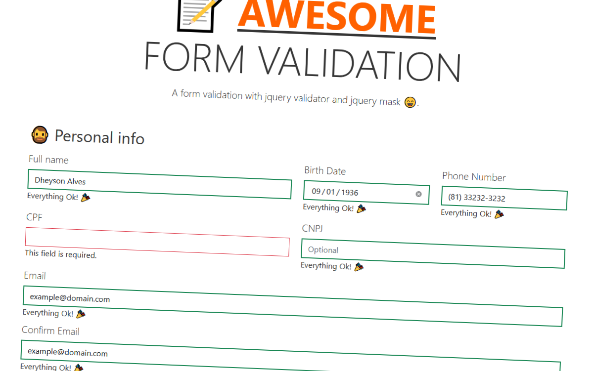

# ❤️ Awesome Form Validation

## 📝 About the Project

A form validation with jquery validator and jquery mask. The main idea came when there were situations when got to create a whole new form validation again, with the same fiels. So created this for me, for kind of a future reference.

Hope you like it 😀.

## 📱 Meta

Dheyson Alves – [@DheysonAlves2](https://twitter.com/DheysonAlves2) – dheyson10@gmail.com

Distributed under the  GNU GENERAL PUBLIC LICENSE. See ``LICENSE`` for more information.

## 👋 Contributing

1. Fork it (<https://github.com/Dheyson/awesome-form-jquery-validator/fork>)
2. Create your feature branch (`git checkout -b feature/fooBar`)
3. Commit your changes (`git commit -am 'Add some fooBar'`)
4. Push to the branch (`git push origin feature/fooBar`)
5. Create a new Pull Request
